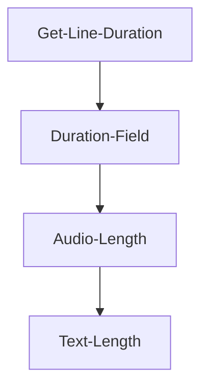

# Dialogue Nodes

The dialogue node is the base node that contains all the details you want in the specific line and shot that is being played. Its generic and used for both the Player and NPCs lines.

## Creating a new node

To create new nodes to add new lines to your dialogue, either right click in the [dialogue graph](./index.md#tabs) and select your speaker or drag from the pin you wish to connect from.

:::note

You can join multiple [speakers](../speakers.md#speakers) nodes together, but you cannot join multiple [player nodes](../speakers.md#player-speakers). You have to separate them by an empty speaker node.

:::

Now you can select the node to enter its details in the **Details** panel.

:::note

The default node comes with some starting text. This can work for some dialogue, but it's much more flexible to keep the first node empty, so you can use [conditions](../../conditions) later.

:::

### Node variables

Each node has many variables that make it work. They are defined below.

| Name                    | Type                                                                       | Description                                                                                                                                                                                         |
|-------------------------|----------------------------------------------------------------------------|-----------------------------------------------------------------------------------------------------------------------------------------------------------------------------------------------------|
| SelectingReplyShot      | [UNarrativeDialogueSequence](../dialogue-sequence)                         | **(NPC node only)** The [UNarrativeDialogueSequence](../dialogue-sequence) that will be used while the user is selecting a player option.                                                           |
|                         |
| OptionText              | FText                                                                      | **(Player node only)** The shortened text to display for dialogue option when it shows up in the list of available responses. If left empty narrative will just use the main text.                  |
| HintText                | FText                                                                      | **(Player node only)** Optional hint text after the option text, ie (Lie, Persuade, Begin Quest) If left empty narrative will see if events have hint text.                                         |
| bAutoSelect             | bool                                                                       | **(Player node only)** If true, this dialogue option will be automatically selected instead of the player having to select it from the UI as long as all [conditions](../../conditions.md) are met. |
|                         |                                                                            |                                                                                                                                                                                                     |
| Text                    | FText                                                                      | The text for this dialogue node.                                                                                                                                                                    |
| Duration                | ELineDuration                                                              | The duration the line should play for.                                                                                                                                                              |
| DurationSecondsOverride | float                                                                      | The overridden seconds the line should play for.                                                                                                                                                    |
| DialogueSound           | USoundBase                                                                 | If a dialogue sound is selected, narrative will automatically play the sound for you in 3D space, at the location of the speaker.                                                                   |
| DialogueMontage         | UAnimMontage                                                               | Narrative will play this montage on the first skeletal mesh component found on your speaker with the tag "Body" added to it.                                                                        |
| FacialAnimation         | UAnimMontage                                                               | Narrative will play this montage on the first skeletal mesh component found on your speaker with the tag "Face" added to it.                                                                        |
| Shot                    | [UNarrativeDialogueSequence](../dialogue-sequence)                         | Shot to play for this line. Overrides speaker shot if one is set.                                                                                                                                   |
| AlternativeLines        | TArray\<[FDialogueLine](./index.md#dialogue-line)\>                        | If alternative lines are added in here, narrative will randomly select either the main line or one of the alternatives.                                                                             |
| OnDialogueFinished      | FOnDialogueNodeFinishedPlaying                                             | Delegate that is called when the dialogue node finishes playing.                                                                                                                                    |
| PlayedLine              | [FDialogueLine](./index.md#dialogue-line)                                  | The last line the dialogue node played.                                                                                                                                                             |
| NPCReplies              | TArray\<[UDialogueNode_NPC](./node-breakdown.md#npc-dialogue-line)\>       | Array of NPC replies for debugging purposes.                                                                                                                                                        |
| PlayerReplies           | TArray\<[UDialogueNode_Player](./node-breakdown.md#player-dialogue-line)\> | Array of player replies for debugging purposes.                                                                                                                                                     |
| OnPlayNodeFuncName      | FName                                                                      | Name of custom event to call when this node is reached.                                                                                                                                             |
| DirectedAtSpeakerID     | FName                                                                      | The ID of the speaker we are saying this line to. Can be left empty.                                                                                                                                |
| bIsSkippable            | bool                                                                       | Should pressing the enter key allow this line to be skipped?                                                                                                                                        |
| Conditions              | TArray\<[UNarrativeCondition](../../conditions)\>                          | Conditions are functions that run before this node is pending selection and contain boolean returns that allow this node to be run or ignored.                                                      |
| Events                  | TArray\<[UNarrativeEvent](../../events)\>                                  | Events are functions that can run at specific states on [quests](../../quests) & [dialogue](../../dialogue).                                                                                        |

:::note

To see a complete breakdown of the variables and how the nodes work, please see the [node breakdown](./node-breakdown.md). 

:::

## Auto-selection

Player options have an additional property to allow them to be auto-selected. This will tell Narrative to skip rendering the option and select the first Player option that is valid and can be taken. (See [conditional dialogue](../../conditions))

This is a great option for when you want the player's character to say something but the user does not have to select it.

## Back-linking

Back linking is the ability to make circular dialogue; Going back up (across) to a node.

This is very useful for creating questions or returning to menu style dialogue.

## Colors

You can change the default colours of a bunch of different Dialogue items.

Go to **Edit** -> **Project Settings** -> **Narrative Dialogues - Editor**.

Here you can see all the colours that you can change.

## Duration

Dialogue has several states of logic it uses in order to calculate the duration of each node. You can overwrite at any level that you require to make the dialogue work how you need it to.

### Get Line Duration
The GetLineDuration node overwrites all duration settings. You can set this and customise any return duration you want.

### Duration
The Duration value can be set with some pre-defined values.

### Audio duration
The default value for the Duration Field is the audio length if audio has been provided.

### Text length duration
If no audio has been found, Narrative will default to the length of the text multiplied by the **Letters Per Second Line Duration value**.

This value can be changed within **Edit** -> **Project Settings** -> **Narrative Dialogues - Gameplay**

## Empty nodes

**Empty nodes** are power tool to keep your dialogue organised. It's often used before a list of player options, so you can connect multiple entries into a single node instead of every player option, but it can be used to also just make the dialogue more readable.

### Compact nodes

Sometimes empty nodes can be used to organise dialogue. You can tick a node's **Compact View** option in the details in order to change it into a smaller, closed version in the editor.

