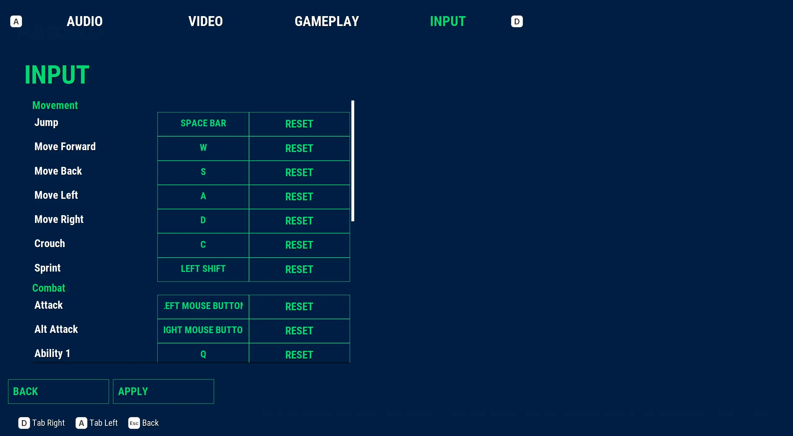

# Pro's Features

Narrative Pro comes packaged with a demo map containing all the features included.

Below is a list of all the features.

:::note

Pro is a full framework and is not built to be modular. It will take C++ knowledge and good Narrative Pro knowledge to remove / replace some aspects.

Some aspects such as the Character Creator can simply be turned off, but other aspects are CORE.

If you do not want the vast majority of the below functionality, consider checking out the modular plugins instead.

_**Please note we will not refund Narrative Pro if you are struggling to integrate it with another plugin or are finding it beyond your technical ability - it is up to you to figure out whether the plugin meets your needs , and if you have questions before purchase you can reach out in the [Discord](https://discord.gg/qyVJmpQ2Pn).**_ 

:::

## Abilities

Full [skill tree and ability system](../abilities/index.md) using Unreal's fantastic [Gameplay Ability System (GAS)](https://dev.epicgames.com/documentation/en-us/unreal-engine/gameplay-ability-system-for-unreal-engine)

Unlockable abilities, skills all fully customisable to meet your games requirement.

[Levels driven by XP](../ui/abilities/Player-stats.md) that can be granted by quests, dialogue or anything you need.

[Videos](../abilities/movies.md) can be provided to show the users exactly what each skill will do.

## AI

[AI behaviour](../npcs/ai/index) built in that can be used as friendly or enemy. Can be used from dialogue, quests or many other methods.

### Companions / followers

Easily turn NPC's into [companions](../npcs/followers.md) who follow you anywhere you go. Fast travelling, battle, dialogue. All ready and built in.

## Books

[Books](../books/index.md) can easily be picked up and used to give the player lore or quests.

## Character Creator

A builtin fully usable Character Creator to allow your users to customise their player in game. Easily modify the character via [Morph Targets and meshes](../inventory/items/equipment/character-appearance.md).

## Combat

Built in combat for melee, ranged or magic weapons using the gameplay ability system (GAS). Easy system to allow you to make the combat you need. Constantly being updated.

## Dialogue

Full [dialogue system](../dialogue/index.md) supported with flexible options, camera, lighting, sound and sequences.

### Seamless transitions

Create [AAA quality transitions](../dialogue/index.md) when moving between gameplay and dialogue with ease.

<video autoPlay muted loop playsinline width="100%">
  <source src="/img/pro/demo-map/seamless-cinematic.mp4" type="video/mp4"/>
  <source src="/img/pro/demo-map/seamless-cinematic.mov" type="video/mov"/>
  Your browser does not support the video tag.
</video>

## Equipment

Any weapons you pick up can be [equipped](../inventory/items/equipment) to your character, so they can be used in combat.

Easy to use [pickups](../interaction/interactables/default-interactables.md#item-pickup) for equipment or quest items.

[Live preview](../ui/inventory/equipment.md) of your character when equipping armour and weapons.

### Armour

Narrative Pro features fully licenced armour created ready to be used. Modular and multi-material ready to be adapted.

### Weapons

An [integrated weapons system](../inventory/items/equipment/weapons/weapons.md) is available when you pick up weapons. You can customise it to meet all your weaponry needs.

### Weapon Attachments

A new system to attach equipment to weapons. Add scopes, silencers and more.

Simply add the attachment to your inventory.

Select it to choose which weapon to equip it to.

The weapon will now have the attachment added.

## First Person mode (FPS)

Built in true first person mode. Fully playable, look around and see your own body not just the arms.

## Interaction

[Interactions](../ui/interaction/index.md) will allow you to use, pickup and interact with objects in the world.

[Lootable bodies](../interaction/index.md) are really easy to add in.

## Interaction Slots

A replacement for Unreal's Smart Objects, that is fully replicated allowing you to assign capacities to interactable objects.

## Inventory

Pressing the **TAB** key will show you your [inventory](../ui/inventory/index.md).

### Looting

Easily create [lootable actors](../inventory/looting) where you can take or give loot. You can loot anything from chests to bad guys.

### Quantity selector

A nice easy to use quantity selector when looting or trading with shops to select your exact quantity.

### Trading / Shops

Create [traders or shops](../inventory/looting/trading.md) in your world, so you can buy and sell anything you want. Its as easy as adding a component and adding properties.

## Narrative Sky

A builtin and easy to use [Narrative Sky](../narrative-sky/index.md) system to allow you to create time based quests and give NPC's schedules.

Daytime:

Nighttime:

## Navigator

You will also see the [compass](../ui/navigator/compass.md) and [minimap](../ui/navigator/minimap.md) showing your locations.

If you start the quest, there is also [on screen markers](../ui/navigator/onscreenmarker.md)

If you enter your menu, you have a [world map](../ui/navigator/worldmap.md) where you can see your entire map, place markers or see [points of interest](../navigator/points-of-interest.md).

[Fast travel screen](//img/pro/demo-map/fasttravelscreen.md) to hide teleporting

## NPC manager

A new [NPC manager tool](../npcs/index.md) has been added, so you can manage every detail about your NPCs from data assets. Names, instances, classes, factions, dialogue, inventory, appearance all stated inside the data asset to make it really easy to track and use NPCs.

## NPC schedules

A new tool allowing you to schedule NPC's to perform certain tasks at specific times or in specific weather making your world come alive.

## NPC spawners

Replacing Narrative Pro 1.1.0's Settlements, NPC Spawners is the new method of managing NPC's in the world. Can be dynamically spawned in making for story based events, NPC spawning and more.

## Pause menu

Pressing **ESCAPE** (or in the editor **SHIFT + ESCAPE**) will open the [pause menu](../ui/pause-menu.md).

### Settings

Clicking the [Settings](../ui/settings/index.md) option will let you change basic game options for audio and video.

#### Gameplay

The gameplay tab inside the Settings menu allows you to easily add [gameplay options](../ui/settings/gameplay-options.md) such as difficulty.

#### Input

Fully configurable input built into the settings menu.

#### Video

The video tab inside the Settings menu allows you to easily modify the graphics settings for the game.

## Quests

Highly customisable [quest system](../quests/index.md) to create quests that interact with anything in the world. Enemies, looting, pickups, dialogue all supported.

### Journal

Detailed [quest journal](../quests/quest-journal.md) to show you all past and present quests. Let your players [track quests](../quests/index.md), see objectives and what they've done.

### Optional quests

Some objectives just aren't required but are nice to have. [Optional quests](../quests/index.md) are built into the quest system with a tick of a box.

## Save & Loading

As soon as you start the game, you will see a brief [loading screen](../ui/loading-screen.md).

Define how many [save slots](../saving/index.md) you want to allow the players to jump between games. Everything is saved, the entire world. Inventories, characters, equipment, states all of it. Highly customisable.

