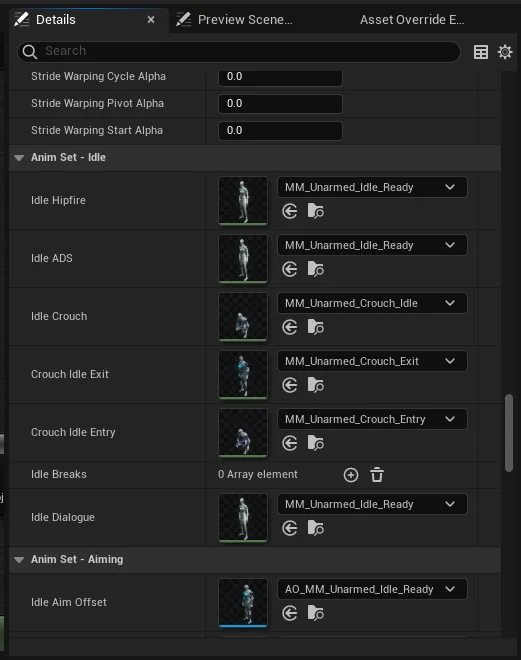

# Player

The player is the main character in the game.

The Blueprint that controls this is the `BP_NarrativePlayerCharacter`. 

This inherits from `Narrative Player Character`.

Both contain variables and functions that make the actor work with Narrative Pro.

## Changing the players mesh

### Mesh

To change the players mesh normally is easy enough as long as your new Skeletal Mesh roughly has the same bones.

Firstly, Set the Body Mesh -> **Skeletal Mesh Asset** and the Mesh -> **Skeletal Mesh Asset**.

### Player Definition

The player definition is a data asset that stores the players initial details.

This is useful if you have default classes in you game to pick from.

From this section, open the Default [Appearance](../inventory/items/equipment/character-appearance.md) asset.

### Default Appearance

This asset contains all the meshes that set up the player. It allows you to create armour sets, skin sets etc...

Populate the meshes with your new custom player mesh.

### Animation Blueprints

The final key to importing your own custom character, is to update the animation blueprints for your new skeleton.

This can be done in multiple ways, but the easiest way is to duplicate the Animation Blueprints you want to use on your character into your content.

:::note

Duplicating the assets instead of replacing them helps to upgrade Narrative Pro in the future without loosing changes.

:::

The final step is to change the Animation Blueprints skeleton by right-clicking on the Animation Blueprint and choosing `Assign Skeleton` then select your new skeleton.

Finally attach these new Animation Blueprints to the Default Appearance asset.

### Animations not working

If your skeleton mesh contains enough differences to the standard Unreal Engine mannequin, it may cause your animations to distort or not function properly.

There are multiple ways to get around this. 

#### Skeleton Retargeting Options

Sometimes when using animations with different proportions to your character, Unreal defaults to scaling the character.

However, you can override this functionality by opening your **Skeleton Mesh** and under **Skeleton Tree**, opening the **cog** and choosing **Show Retargeting Options**.

Under the root of your actor (normally the **hips** or **pelvis**), open the Animation Scaled drop down and choose **Skeleton**. This should re-scale the animation to fit your skeleton instead.

#### Animation Retargeting

If the above doesn't work, it's likely that your skeleton just isn't compatible with the provided animations.

We need to update the animations to tell them how to correctly use your skeleton via **Retargeting**.

:::note

This process is quite involved. It is recommended you have some experience with Retargeting and Animation Blueprints to make it easier to follow.

:::

Firstly select all the animations you wish to retarget, right click and choose **Retarget Animations**.

Next, select your **Target Skeletal Mesh** and double-click on some animations to make sure it maps up correctly.

If it does not, you will have to create a [retarget asset](https://www.youtube.com/watch?v=U4ykEkKv61A) to manually specify the links.

Once you have the animations mapped, you can then export all the animations into a new location for your new character.

Finally, You need to bulk update the Animation Blueprint to use your new animations. 

[Duplicate your animation blueprint](./index.md#animation-blueprints) and set its skeleton to your new mesh's skeleton.

Finally open the animation blueprint and head into the Details panel.

Throughout this you will see a variety of options that control the animations for this character. Change these to your new animations.

:::note

It's going to be easier test a few animation at once so you know its working and can track it.

:::

You will need to do this same action for the other Animation Blueprints that control your weapons.