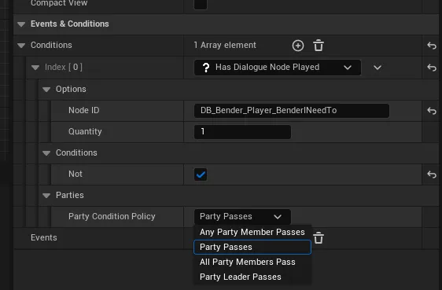

# Dialogue & Quests

When using a party component, dialogue & quests by default will work for an individual player.

This means that multiple players can start dialogue or quests independent of one another.

However, the benefit of using the party system is the ability to tie players together for quests & dialogue and the party system makes this really easy.

## Quests

To enable a quest to be shared across all members of the party you need to start the quest on the [Narrative Party component](index.md) instead of the players component.

<iframe src="https://blueprintue.com/render/c6r2dwrg/" width="100%" height="400" scrolling="no" allowfullscreen></iframe>

This will start the quest for all members within the party. Each time a member completes a task, it will complete it for all members at the same time.

## Dialogue

To begin dialogue shared across all members of the party you need to call BeginDialogue on the [Narrative Party component](index.md) instead of the players component.

<iframe src="https://blueprintue.com/render/cs7ncnq_/" width="100%" height="400" scrolling="no" allowfullscreen></iframe>

### Dialogue options

During dialogue, options will be displayed to the players to advance the conversation. Narrative gives users the ability to decide which players can select the options.

| Enumerator Name              | Description                                                                                                                                 |
|------------------------------|---------------------------------------------------------------------------------------------------------------------------------------------|
| Party Leader Controlled      | This option will allow only the [leader of the party](./index.md#party-leader) to pick dialogue options.                                    |
| All Party Members Controlled | This option will give each party member access to the dialogue options. When any player selects an option, it will advance for all members. |

## Events

Events within dialogue & quests have an enum property called `Party Event Policy`. This controls how the event runs.

Changing this property will allow you to customise how events run for your dialogue or quests.

 
| Enumerator Name   | Description                                                                                                                           |
|-------------------|---------------------------------------------------------------------------------------------------------------------------------------|
| Party             | This event will run on the party component for the quest. Perfect for spawning quest actors for the party.                            |
| All Party Members | This event will be run once for each party member on their Narrative component directly. Perfect for granting rewards to each member. |
| Party Leader      | This event will run only for the [leader of the party](./index.md#party-leader).                                                      |

## Conditions

Conditions within dialogue have an enum property called `Party Condition Policy`. This controls how the condition checks its state.

Changing this property will allow you to customise how / what conditions check for your dialogue.

| Enumerator Name         | Description                                                                                                                 |
|-------------------------|-----------------------------------------------------------------------------------------------------------------------------|
| Any Party Member Passes | The condition will check all party members, if any member passes then the condition will pass successfully.                 |
| Party Passes            | The condition will check if the party component shared across all members passes then the condition will pass successfully. |
| All Party Members Pass  | The condition will check if every member passes, if a single one fails the condition will fail.                             |
| Party Leader Passes     | The condition will check if only the [leader of the party](./index.md#party-leader) passes, then the condition will pass.   |