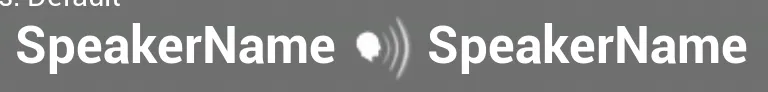

# WBP_DefaultDialogueNode

This widget is used in the dialogue asset graph. It is built up from standard Unreal widgets to render the UI.

## Text_Shot

These widgets display which camera shot is set as the shot is playing.

## HB_SpeakerInfo

This widget is built up of icons and TextBoxes. It's used for identifying who is speaking to who for aiming and rotation purposes.

## TB_ConditionsTitle

This widget simply states the conditions start point.

## ConditionText

This widget will display all conditions for this node.

## TB_EventsTitle

This widget simply states the events start point.

## TB_Events

This widget will display all events for this node.

## EventsIcon

This icon is triggered when an event is added to this node.

## TB_DialogueLine

This widget handles displaying the dialogue line on the node.

